# ⚽ KickOff - Sistema de Gestão Desportiva

O **KickOff** é um sistema web desenvolvido em **Kotlin** com o framework **Ktor** no backend, utilizando **HTML, CSS e JavaScript** para o frontend e **MySQL** como base de dados. O objetivo principal é a gestão completa de uma plataforma de resultados desportivos, notícias, ligas, clubes e classificações.

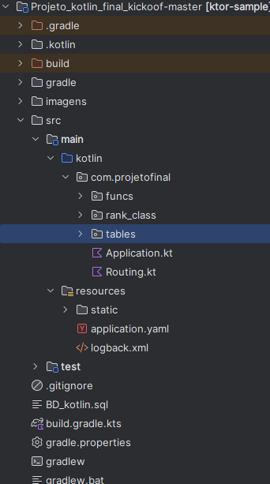

---

## 📌 Índice

- [Introdução](#-introdução)
- [Estrutura e Tecnologias](#-estrutura-e-tecnologias)
- [Instalação e Configuração](#-instalação-e-configuração)
- [Configuração do MySQL](#configuração-do-mysql)
- [Configuração da Base de Dados](#configuração-da-base-de-dados)
- [Como Iniciar o Projeto](#-como-iniciar-o-projeto)
- [Funcionalidades](#-funcionalidades)
    - [Interface de Utilizador](#interface-de-utilizador)
        - [1. Login](#1-login)
        - [2. Registo](#2-registo)
        - [3. Homepage (Utilizador)](#3-homepage-utilizador)
        - [3.1 Resultados](#31-resultados)
        - [3.2 Classificações](#32-classificações)
        - [3.3 Notícias](#33-notícias)
    - [Interface de Administração (ADM)](#interface-de-administração-adm)
        - [4. Homepage (ADM)](#4-homepage-adm)
        - [4.1 Gerir Resultados](#41-gerir-resultados)
        - [4.2 Publicar Notícias](#42-publicar-notícias)
        - [4.3 Gerir Utilizadores](#43-gerir-utilizadores)
        - [4.4 Gerir Equipas](#44-gerir-equipas)
        - [4.5 Gerir Ligas](#45-gerir-ligas)
        - [4.6 Gerir Jogos](#46-gerir-jogos)
- [Resolução de Problemas](#-resolução-de-problemas)
- [Créditos](#-créditos)

---

## 📝 Introdução

O sistema **KickOff** permite aos utilizadores acompanhar o mundo do futebol de forma simples e intuitiva. Oferece funcionalidades que vão desde o registo de utilizadores até à gestão avançada de jogos e estatísticas em tempo real para administradores.

---

## 🛠 Estrutura e Tecnologias

O projeto foi construído com as seguintes ferramentas:

| Categoria          | Tecnologias                                      |
| :----------------- | :----------------------------------------------- |
| **Linguagem**      | Kotlin                                           |
| **Backend**        | Ktor                                             |
| **Frontend**       | HTML5, CSS3, JavaScript                          |
| **Base de Dados**  | MySQL (v8.0.39)                                  |
| **Dependências**   | Gradle                                           |

---

## ⚙️ Instalação e Configuração

### Configuração do MySQL

Antes de executar o projeto, é necessário instalar o MySQL Installer e o MySQL Workbench.

1. Descarregue o instalador em: [MySQL Downloads](https://dev.mysql.com/downloads/installer/).
2. Recomenda-se a versão **8.0.39**.

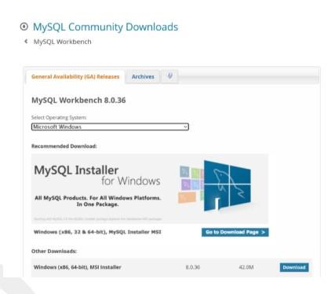
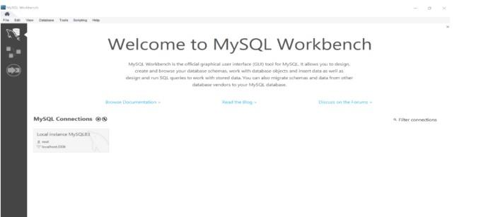

### Configuração da Base de Dados

1. No **MySQL Workbench**, crie uma conexão local.
2. Crie um schema chamado `kickoof`.

> **Nota:** Se usar outro nome, altere o `jdbcUrl` no ficheiro `Application.kt`.

3. Realize o **Data Import**:
    - Vá a `Server > Data Import`.
    - Selecione "Import from Self-Contained File" e aponte para o ficheiro `BD_kotlin`.
    - Escolha o schema de destino e clique em **Start Import**.

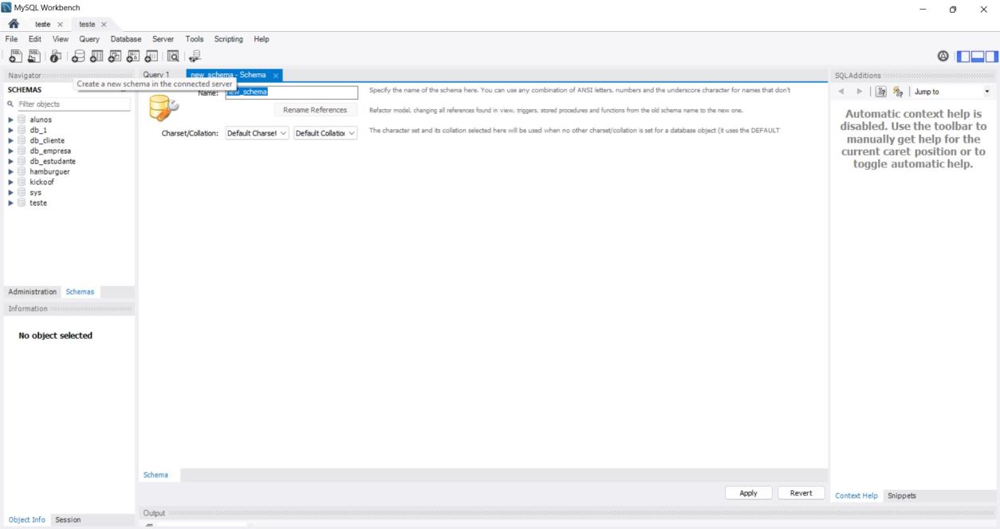
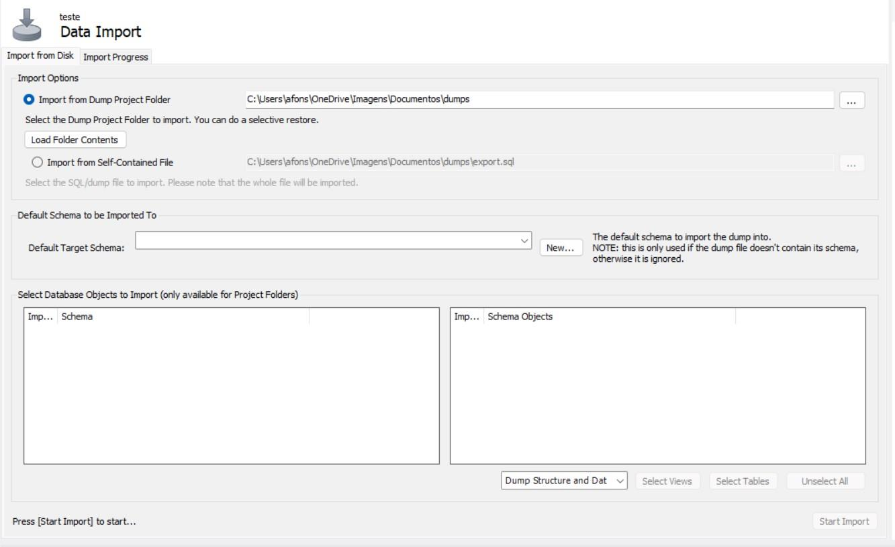

---

## 🚀 Como Iniciar o Projeto

1. Abra o projeto no **IntelliJ IDEA**.
2. Navegue até `src/main/kotlin/Application.kt`.
3. Configure a sua password da base de dados na variável `password`.
4. Execute o projeto.
5. No navegador, aceda a: `http://localhost:8082/static/index.html`.

---

## ✨ Funcionalidades

### Interface de Utilizador

#### 1. Login

Ao aceder à página de login, deve introduzir o **nome de utilizador** e a **palavra-passe**.

- Se algum dos campos estiver em branco, o sistema solicitará que os preencha.
- Caso o nome de utilizador não exista ou a palavra-passe esteja incorreta, será informado de que as credenciais estão erradas.
- Se os dados estiverem corretos, o sistema verificará se é administrador ou um utilizador normal e, com base nisso, será redirecionado para a página correspondente.

---

#### 2. Registo

Ao aceder à página de registo, terá de preencher os campos obrigatórios:
- Nome de utilizador
- Nome
- Email
- Palavra-passe
- Data de nascimento
- Nacionalidade

**Validações:**
- Se algum campo estiver vazio ou a data de nascimento não for válida (idade inferior a 13 anos), será notificado.
- O sistema verifica se a nacionalidade existe e se o nome de utilizador ou email já estão registados.
- A palavra-passe precisa ser forte. Caso contrário, será solicitado que crie uma palavra-passe mais segura.

Após todas as validações, a palavra-passe é criptografada e os dados são guardados na base de dados. Se tudo estiver correto, será redirecionado para uma página de sucesso.

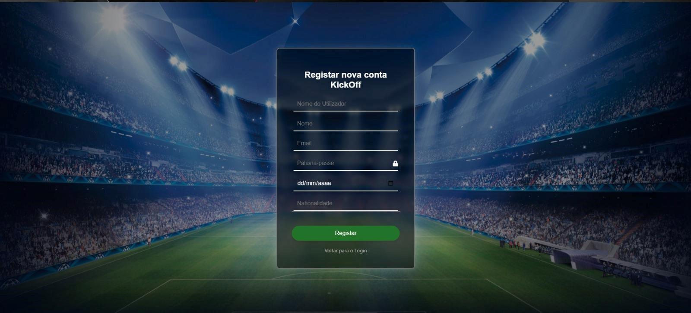

---

#### 3. Homepage (Utilizador)

Aqui é apresentado o Menu Principal para quem **não tem privilégios administrativos**.

Dentro deste menu tem as seguintes opções:

---

##### 3.1 Resultados

Aqui irá visualizar os resultados dos jogos. Pode filtrar por dia.  
*Exemplo:* Selecionar `25/12/2024` e ver os jogos realizados nesse dia.

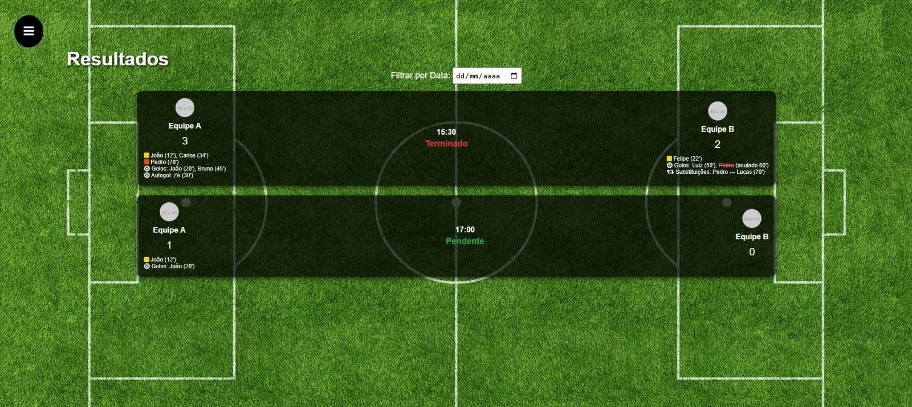

---

##### 3.2 Classificações

Aqui irá ver as classificações dos clubes de cada liga.  
Pode filtrar uma liga e visualizar:
- Posição do clube
- Número de vitórias, derrotas, empates
- Saldo de golos
- Pontos

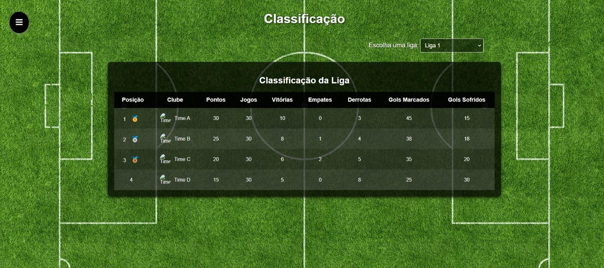

---

##### 3.3 Notícias

Aqui pode ver as notícias sobre as equipas ou jogadores.  
Pode filtrar por categoria (ex: Transferências, Todos, etc.).

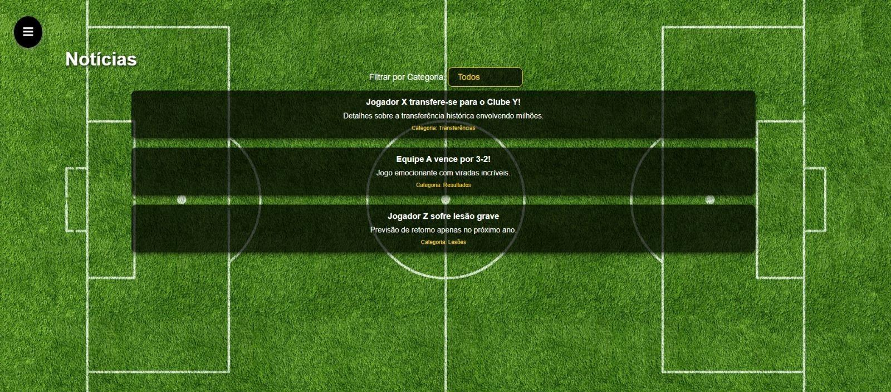

---

### Interface de Administração (ADM)

> **Acesso de demonstração:**  
> **Username:** `jorge_2`  
> **Password:** `J0rgec@stro`

#### 4. Homepage (ADM)

Aqui é o Menu de Administração para quem tem privilégios administrativos. Permite gerenciar todos os aspectos do sistema.

---

##### 4.1 Gerir Resultados

Esta view permite gerir os jogos de futebol que ocorrem na **data atual**.

- Apenas os jogos agendados para o dia atual serão exibidos.
- Funcionalidades:
    - Registo de golos (normais ou autogolos)
    - Registo de cartões amarelos/vermelhos
    - Atualização do estado do jogo (`A decorrer` ou `Terminado`)

**Validações** asseguram a consistência dos dados e a elegibilidade dos jogadores.  
Ao terminar um jogo, o sistema calcula automaticamente os resultados, atualiza as estatísticas das equipas na base de dados e ajusta o saldo de golos.

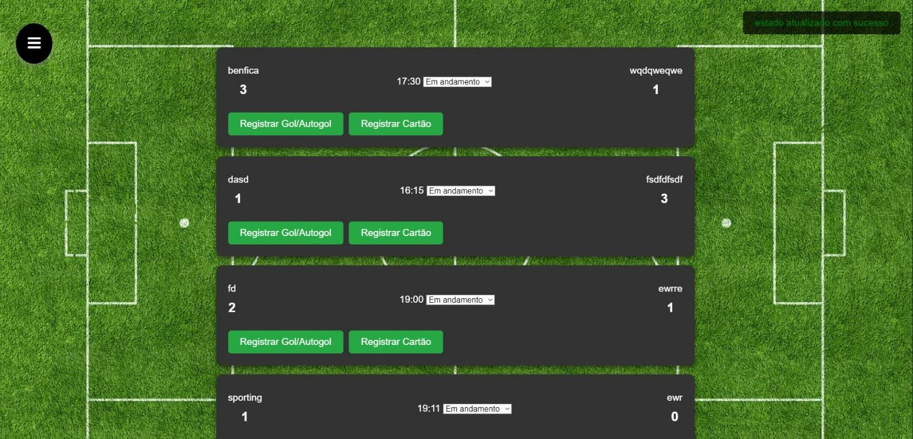

---

##### 4.2 Publicar Notícias

Poderá publicar/criar notícias aqui.  
Adicionar:
- Título
- Descrição
- Categoria

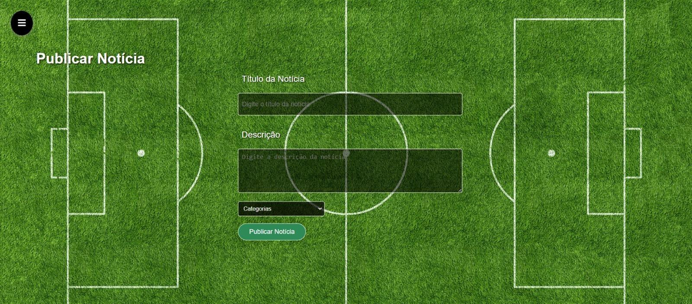

---

##### 4.3 Gerir Utilizadores

Aqui no gerir utilizadores, vai poder:
- Eliminar a conta de um utilizador
- Pesquisar o nome de um utilizador
- Promover um utilizador a administrador

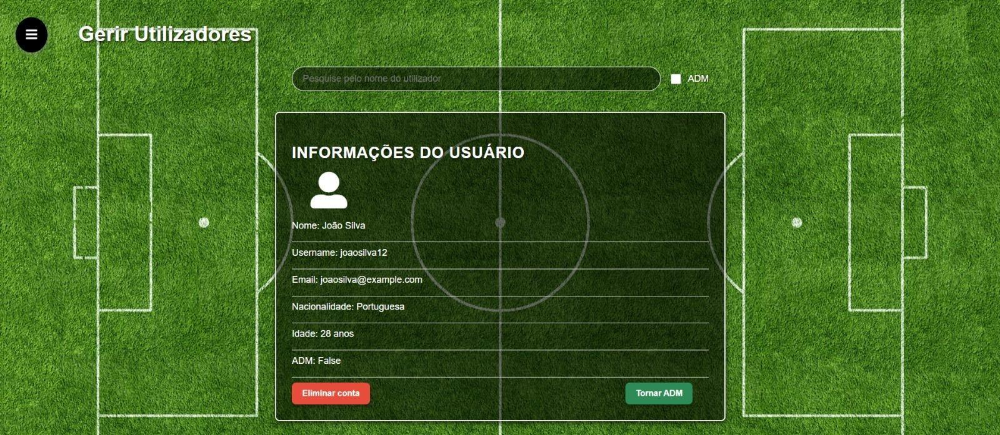

---

##### 4.4 Gerir Equipas

Aqui pode:
- Criar uma equipa
- Editar informações de equipas existentes (nome, emblema, jogadores)
- Eliminar uma equipa

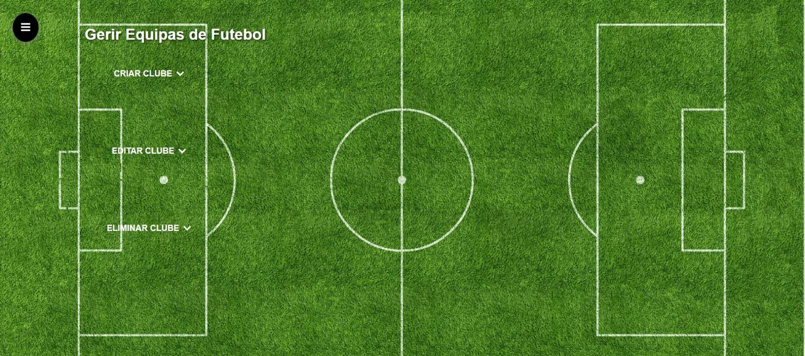

---

##### 4.5 Gerir Ligas

Aqui poderá:
- Criar uma liga
- Editar uma liga
- Eliminar uma liga

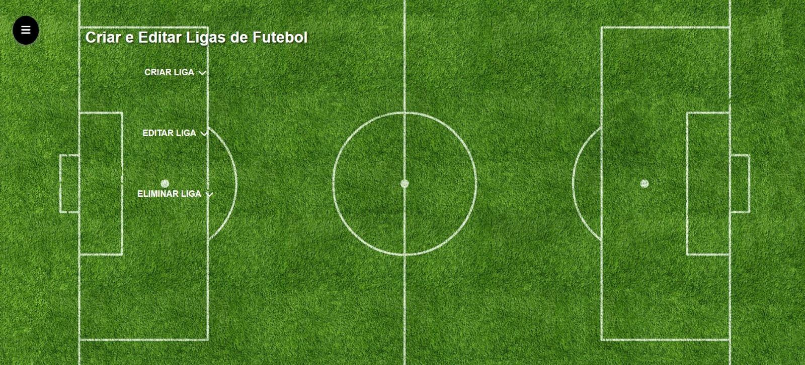

---

##### 4.6 Gerir Jogos

Aqui pode:
- Criar um jogo
- Editar um jogo
- Eliminar um jogo

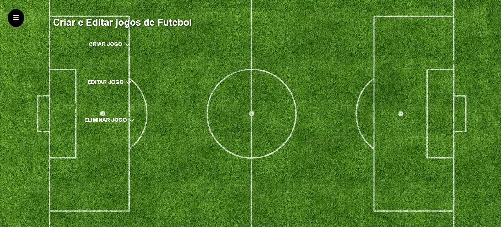

---

## ⚠️ Resolução de Problemas

| Erro | Solução |
| :--- | :------ |
| **Erro no Build (test)** | Pode ocorrer um erro durante os testes automatizados. Este erro pode ser ignorado, pois não impede a execução do projeto. |
| **Erro SLF4J** | Ao iniciar, pode surgir um aviso sobre o SLF4J não ser encontrado. Se a aplicação conectar à base de dados, ignore a mensagem. |

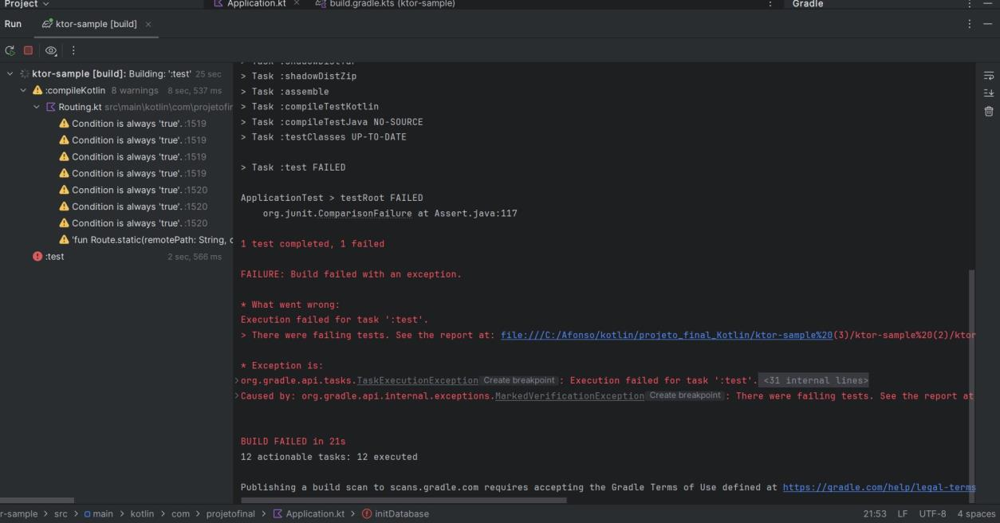
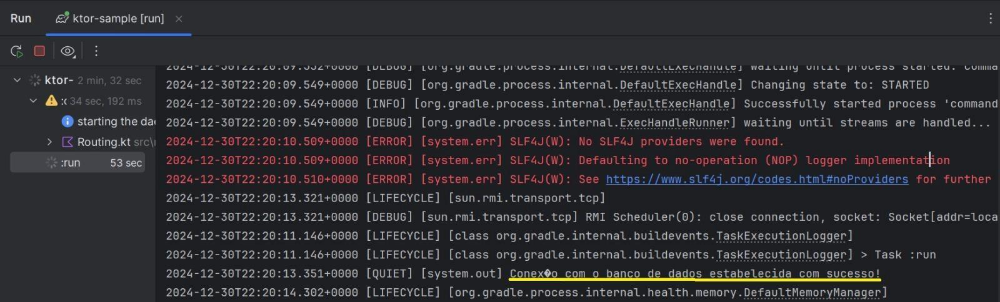

---

## 👥 Créditos

Projeto desenvolvido por:

- **Jorge Castro** - nº 2024454
- **Turma:** DDM

